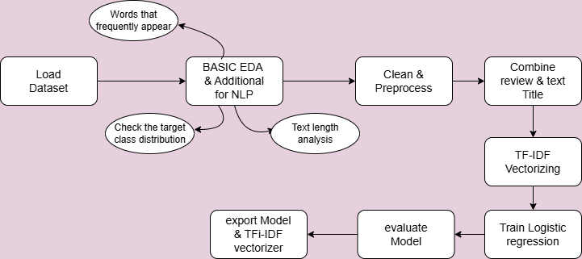
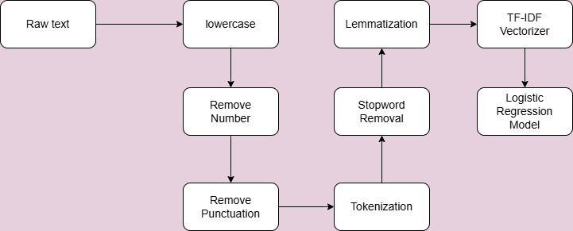

# Sentimen Analisis - Logistic Regression + NLP

This project aims to analyze sentiment from sales reviews, The model used in this project is trained with Amazon Dataset and uses **Natural Language Processing (NLP)** techniques and **Logistic Regression** algorithm. The model is trained using **Google Colab**, and used/deployed via **VSCode**.

## Feature

- Preprocessing text (cleaning, stopword removal, stemming)
- Vectorization text (TF-IDF)
- Training model Logistic Regression
- Evaluation of model accuracy
- Sentiment precdict (Positive / Negative)
- Run model locally on IDE 

## Machine Learning model

- **Algorithm**: Logistic Regression
- **NLP Pipeline**:
  - Case folding
  - Digit removal
  - Punctuation Removal
  - Tokenizing
  - Stopword removal
  - Lemmatization
  - TF-IDF Vectorization

## Tools & Library

- Python
- Google Colab (For training model): [Link](https://colab.research.google.com/drive/1ljIgUG65GTcuhj8ZkR46oWeK37-wii9p?usp=sharing)
- Dataset: [Link](https://drive.google.com/file/d/16R_I6P3HBbP63uFi8M0IAYdcnOId3WGC/view?usp=sharing)
- VSCode (For run model)
- Pandas, NumPy, scipy.stats
- scikit-learn
- NLTK / Sastrawi (untuk preprocessing bahasa)
- Matplotlib / Seaborn (opsional: visualisasi)

## Visual diagram

**Flowchart Project**:

**Flowchart NLP pipeline**

## Installation Instruction
 - Clone repository
 - Open VS Code
 - Run the test.py file
 - Enter a review

