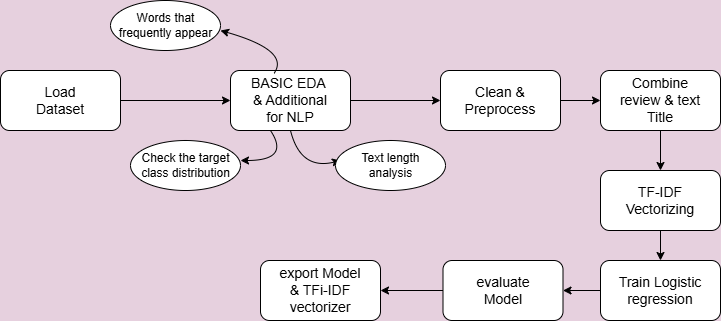
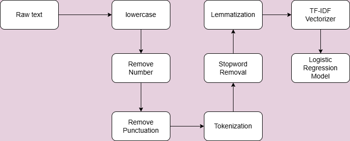
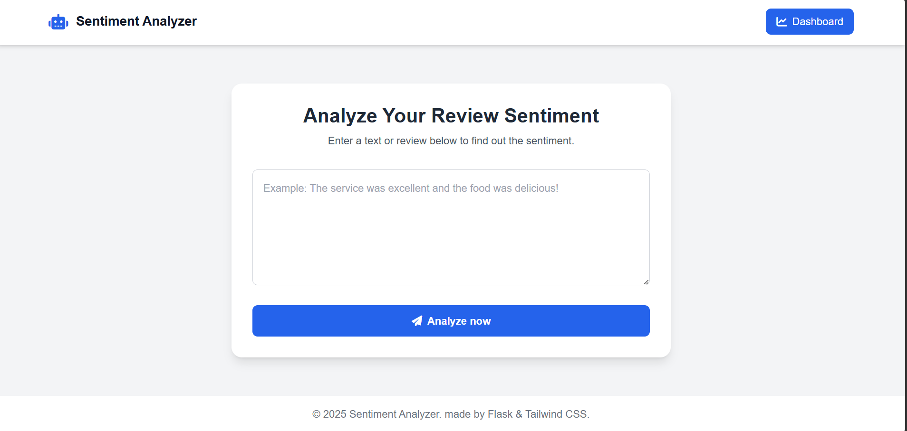
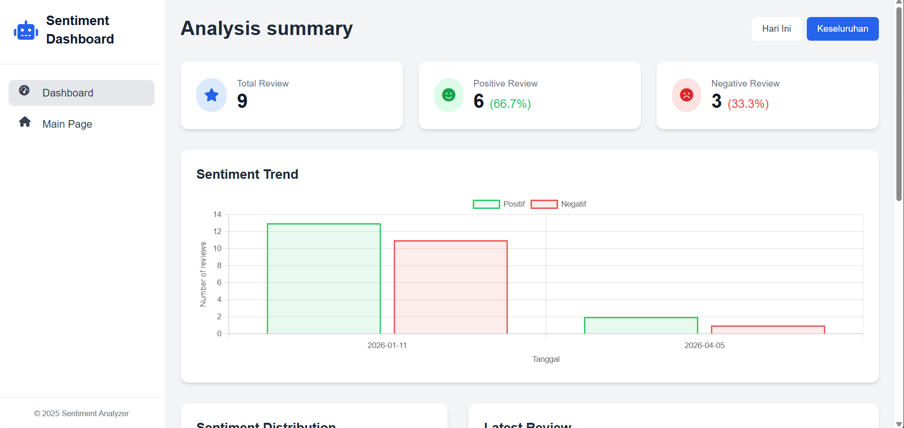
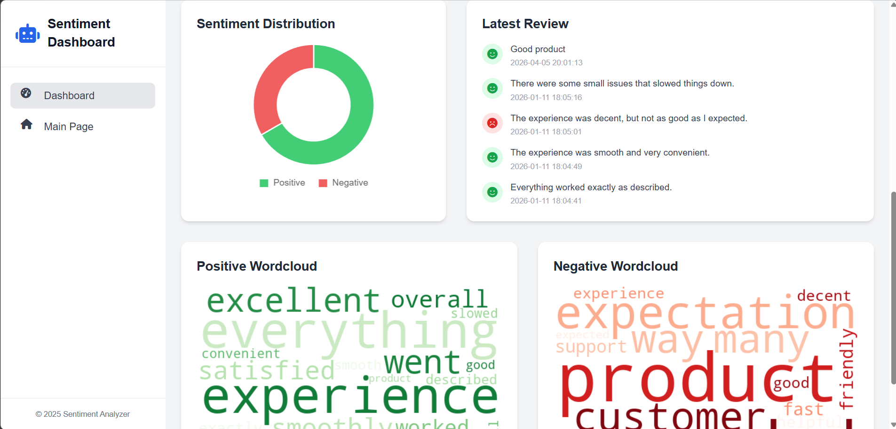

# Sentimen Analisis - Logistic Regression + NLP

This project aims to analyze sentiment from sales reviews, The model used in this project is trained with Amazon Dataset and uses **Natural Language Processing (NLP)** techniques and **Logistic Regression** algorithm. The model is trained using **Google Colab**, and used/deployed via  **Web page**.

## Feature

- Preprocessing text (cleaning, stopword removal, stemming)
- Vectorization text (TF-IDF)
- Training model Logistic Regression
- Evaluation of model accuracy
- Sentiment precdict (Positive / Negative)
- Run model locally on IDE 

## Machine Learning model

- **Algorithm**: Logistic Regression
- **NLP Pipeline**:
  - Case folding
  - Digit removal
  - Punctuation Removal
  - Tokenizing
  - Stopword removal
  - Lemmatization
  - TF-IDF Vectorization

## Tools & Library

- Python
- Google Colab (For training model): [Link](https://colab.research.google.com/drive/1ljIgUG65GTcuhj8ZkR46oWeK37-wii9p?usp=sharing)
- Dataset: [Link](https://drive.google.com/file/d/16R_I6P3HBbP63uFi8M0IAYdcnOId3WGC/view?usp=sharing)
- VSCode (For run model)
- Pandas, NumPy, scipy.stats
- scikit-learn
- NLTK / Sastrawi (Language preprocessing)
- Matplotlib / Seaborn (Visualization)
- HTML, CSS, JS, Tailwind(Front end stack)

## Visual diagram

**Flowchart Project**:

**Flowchart NLP pipeline**

## Project Overview
**User Review Input**

**Dashboard**

## Installation Instruction
- Clone the repository from GitHub
- Navigate to the project directory
- Download the provided database file
- Import the database into your DBMS (MySQL Workbench / phpMyAdmin)
- Ensure the database name is sentiment_db
- Open the project in VS Code
- Create a virtual environment using python -m venv venv
- Activate the virtual environment (venv\Scripts\activate for Windows or source venv/bin/activate for Mac/Linux)
- Install all dependencies using pip install -r requirements.txt
- Configure the database connection in your Python file (host, user, password, database)
- Run Python and download NLTK resources (stopwords and wordnet)
- Start the application using python app.py

